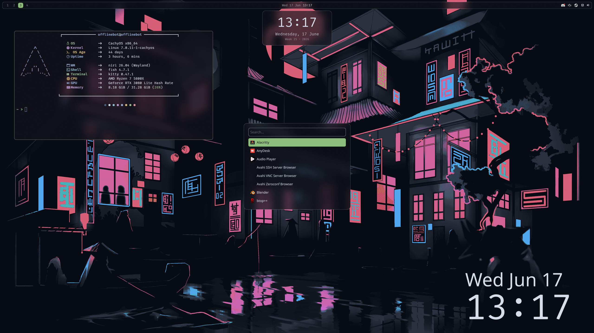
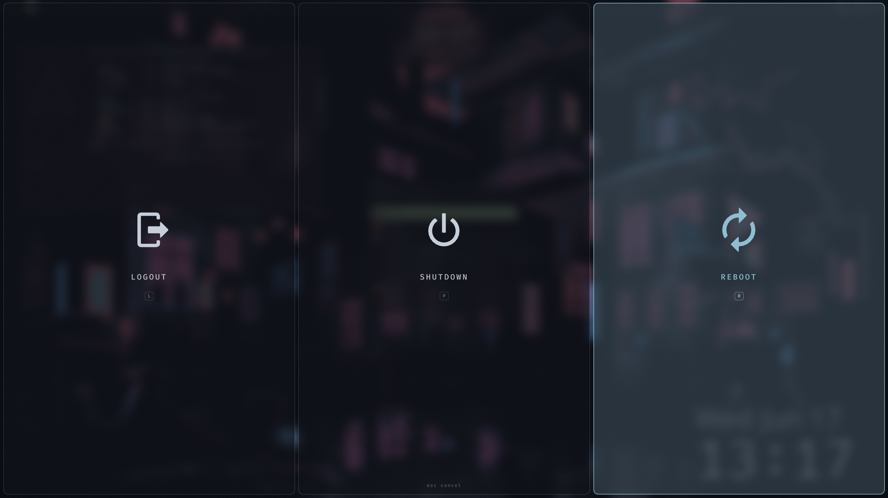

# nix-configuration

Meine NixOS Config. Ein Repo, zwei Branches:

- Branch `system` liegt unter `~/.nix` und enthaelt die `configuration.nix` (Flake).
- Branch `home` liegt unter `~/.home` und enthaelt die Home-Manager Config (Flake).
- Branch `dotfiles` liegt unter `~/.dotfiles` und enthaelt die Dotfiles (Flake + stow-kompatibel).

## Struktur

```
~/.nix    (branch: system)        ~/.home   (branch: home)        ~/.dotfiles (branch: dotfiles)
  flake.nix                         flake.nix                        flake.nix
  configuration.nix                 home.nix                         .config/
  hardware-configuration.nix                                         Pictures/
```

## Anwenden

System:

```sh
sudo nixos-rebuild switch --flake ~/.nix#nixos
```

Home-Manager:

```sh
home-manager switch --flake ~/.home#offlinebot
```

## Dotfiles

Klonen nach `~/.dotfiles`:

```sh
git clone -b dotfiles https://github.com/offlineBot/nix-configuration.git ~/.dotfiles
```

Flake (Home-Manager, Symlinks via `mkOutOfStoreSymlink`):

```sh
home-manager switch --flake ~/.dotfiles#offlinebot
```

stow:

```sh
cd ~/.dotfiles && stow .
```

## System (configuration.nix)

- Bootloader: systemd-boot (UEFI)
- Desktop: GNOME (GDM) und niri
- Audio: PipeWire
- Shell: fish
- Netzwerk: NetworkManager, Tailscale
- Browser: Firefox
- Locale: en_US.UTF-8 mit de_DE Regional, Zeitzone Europe/Berlin

## Screenshots

Example screenshots of the desktop:

<p align="center">
  
  
</p>

